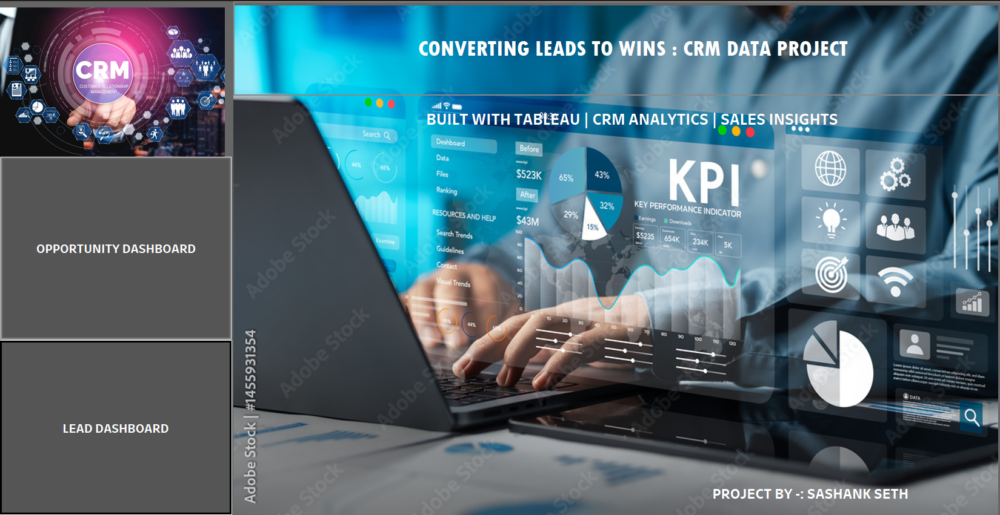
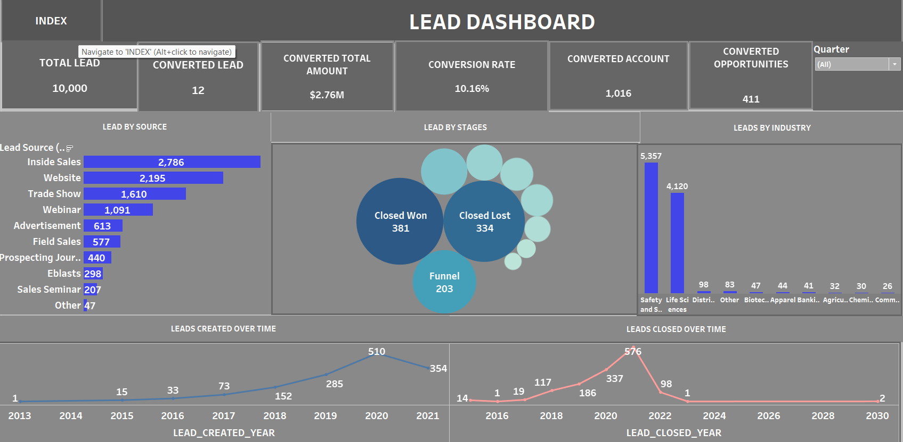
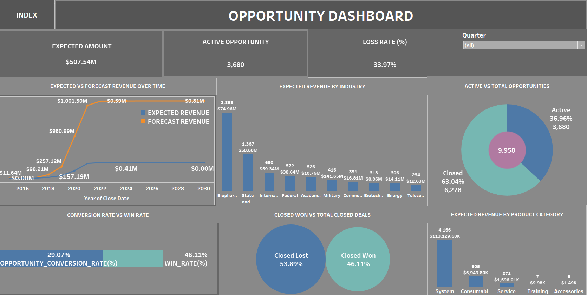

# 📊 CRM Data Project – Converting Leads to Wins

This project presents a CRM sales funnel analysis built using **Tableau**, helping businesses understand how leads transition into revenue-generating opportunities.

---

## 🔍 Objective

To build an interactive analytics dashboard that visualizes and analyzes:
- Lead conversion performance  
- Opportunity funnel trends  
- Revenue forecasting  
- Sales effectiveness

---

## 💼 Key Dashboards

### 1. **Lead Dashboard**
- Total leads vs. converted leads
- Conversion rate and revenue from converted leads
- Leads by source (e.g., inside sales, website, webinars)
- Funnel stage summary (Closed Won, Closed Lost, etc.)
- Lead trends over time and by industry

### 2. **Opportunity Dashboard**
- Expected vs forecast revenue over time
- Conversion rate vs win rate
- Active vs closed opportunities
- Expected revenue by industry and product category
- Deal status breakdown (Closed Won, Closed Lost)

---

## 📈 Tools Used

| Tool     | Purpose                         |
|----------|----------------------------------|
| Tableau  | Data visualization               |
| Excel    | Raw data preprocessing           |
| GitHub   | Project documentation & sharing  |

---

## 🖼️ Screenshots

### 📌 Cover Page

### 📊 Lead Dashboard

### 📊 Opportunity Dashboard

---

## 📂 File Structure
crm-leads-to-wins-dashboard/
├── CRM_PROJECT_COVER.png
├── LEAD_DASHBORAD.png
├── OPPORTUNITY_DASHBOARD.png
├── README.md
└── CRM_PROJECT_DASHBOARD
---

## 🙋‍♂️ Author

**Sashank Seth**  
📧 sashank.seth221092@gmail.com

---

## 📌 Notes

- This project is intended for demonstration purposes and may use anonymized or sample data.
- Built to demonstrate skills in CRM analytics, Tableau dashboards, and data storytelling.

---

⭐ If you found this useful, feel free to fork, star, or connect!

